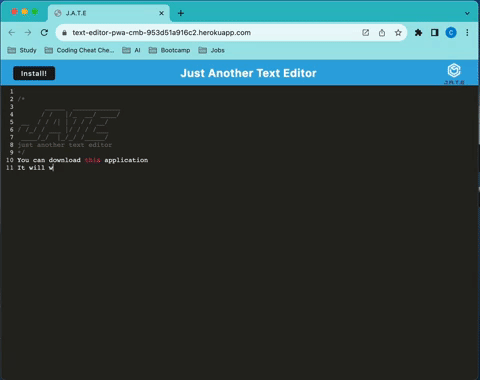

<div style="display: flex; justify-content: center; align-items: center;">
    
</div>

# Progressive Web Application (PWA): Text Editor
## 🌟 Description
Step into the future of web apps with this robust Text Editor crafted to meet the standards of Progressive Web Applications (PWA). With an emphasis on offline reliability and efficient data storage, this editor ensures that your notes and code snippets are securely saved and easily accessible. This application makes use of cutting-edge technologies such as the idb package for data management and features a streamlined deployment process for Heroku.
## 📜 User Story
```
AS A developer
I WANT to create notes or code snippets with or without an internet connection
SO THAT I can reliably retrieve them for later use
```
## 🌍 Deployment
<a href="https://text-editor-pwa-cmb-953d51a916c2.herokuapp.com"></a>

## ▶️ Usage
1. Using the Text Editor (Powered by JavaScript and Next-gen ES6+ features):
- Start typing or pasting your text into the editor area. You don't need to manually save your work! As you type or when you click outside the text editor window, your content gets automatically saved in the secure storage backed by IndexedDB – a powerful browser-based database.

2. Saving Your Content (Enhanced with IndexedDB):
- If you close the text editor and return later, you'll find your content right where you left it, thanks to the efficient retrieval system utilizing IndexedDB for persistent, offline storage.
3. Revisiting and Retrieving Content (Progressive Web App Features):
- Spot the "Install" button, typically found at the top or bottom of the page.Clicking this button leverages the Web App Manifest and Service Workers allowing you to download the web application for offline use. It will appear as an icon on your desktop or device's home screen, just like native apps.

4. Navigating the Application (Optimized with Service Workers and Workbox):
- Experience seamless navigation with our app preloading the subsequent pages and assets for you using Service Workers. These ensure your user experience is smooth and lightning-fast, even when offline, by caching static assets through Workbox.

## 💻 Technologies Used
[Node.js](https://nodejs.org/en)
[Express.js](https://expressjs.com/)
[IndexedDB](https://developer.mozilla.org/en-US/docs/Web/API/IndexedDB_API)
[idb package](https://www.npmjs.com/package/idb)
[Webpack](https://webpack.js.org/)
[Workbox](https://developers.google.com/web/tools/workbox)
## 📄 License
[](https://opensource.org/licenses/MIT)
This project uses the MIT license.

## 👏 Acknowledgements
edX Boot Camps LLC for the project prompt and resources.
